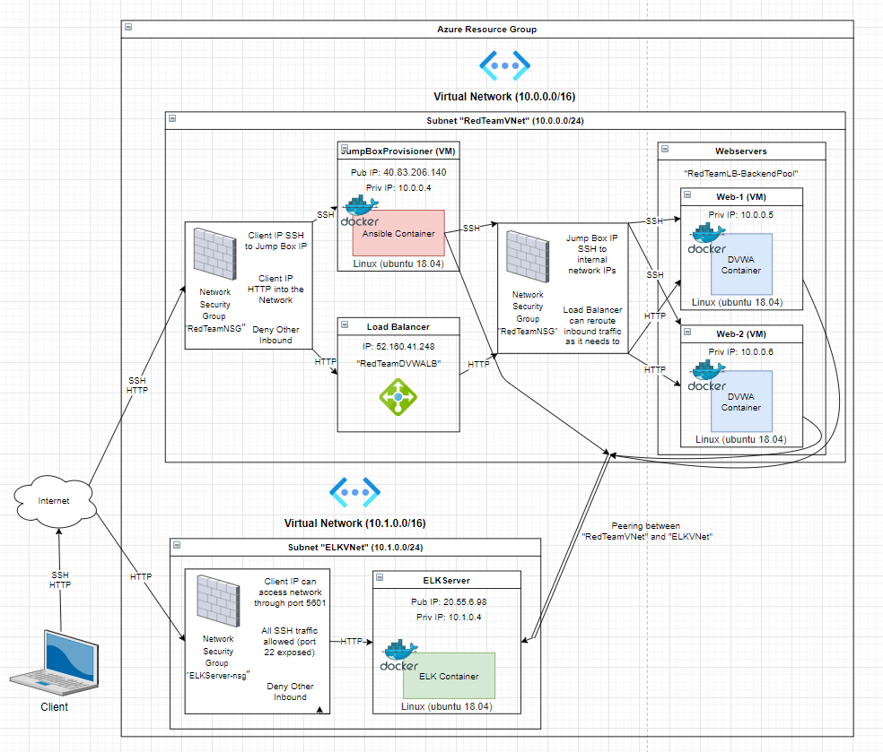
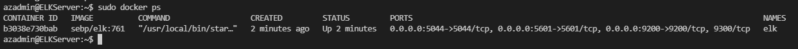

## Automated ELK Stack Deployment

The files in this repository were used to configure the network depicted below.

These files have been tested and used to generate a live ELK deployment on Azure. They can be used to either recreate the entire deployment pictured above. Alternatively, select portions of the playbook files may be used to install only certain pieces of it as, for example, you can leave out [Install-Metricbeat-Playbook.yml](Install-Metricbeat-Playbook.yml) and [Metricbeat-Config.yml](Metricbeat-Config.yml) to omit the addition of Metricbeat to your network.

This document contains the following details:
- Description of the Topologu
- Access Policies
- ELK Configuration
  - Beats in Use
  - Machines Being Monitored
- How to Use the Ansible Build

### Description of the Topology

The main purpose of this network is to expose a load-balanced and monitored instance of DVWA, the D*mn Vulnerable Web Application.

Load balancing ensures that the application will be highly efficient and reliable, protecting the networks availability by balancing traffic between the two web servers. Meanwhile, the Jump Box works to keep unwanted traffic out of the network by acting as the gateway via whitelisted IP addresses.

Integrating an ELK server allows users to easily monitor the vulnerable VMs for changes to the metrics and system logs.

["Filebeat monitors the log files or locations that you specify, collects log events, and forwards them either to Elasticsearch or Logstash for indexing."](https://www.elastic.co/guide/en/beats/filebeat/current//filebeat-overview.html)

["Metricbeat takes the metrics and statistics that it collects and ships them to the output that you specify, such as Elasticsearch or Logstash."](https://www.elastic.co/guide/en/beats/metricbeat/7.14/metricbeat-overview.html#:~:text=Metricbeat%20takes%20the%20metrics%20and,HAProxy)

The configuration details of each machine may be found below.

| Name               | Function      | IP Address    | Operating System    |
|--------------------|---------------|---------------|---------------------|
| JumpBoxProvisioner | Gateway       | 10.0.0.4      | Linux (ubuntu 18.04)|
| Web-1              | Web Server    | 10.0.0.5      | Linux (ubuntu 18.04)|
| Web-2              | Web Server    | 10.0.0.6      | Linux (ubuntu 18.04)|
| ELKServer          | ELK Container | 10.1.0.4      | Linux (ubuntu 18.04)|

### Access Policies

The machines on the internal network are not exposed to the public Internet. 

Only the Jump Box Provisioner can accept connections from the Internet. Access to this machine is only allowed from the Client IP 

Other machines within the network can only be accessed by the Jump Box, IP 10.0.0.4.

A summary of the access policies in place can be found in the table below.

| Name               | Publicly Accessible | Allowed IP Addresses |
|--------------------|---------------------|----------------------|
| JumpBoxProvisioner | No                  | Client IP            |
| Web-1              | No                  | 10.0.0.4             |
| Web-2              | No                  | 10.0.0.4             |
| ELKServer          | No                  | 10.0.0.4             |

### Elk Configuration

Ansible was used to automate configuration of the ELK machine. No configuration was performed manually, which is advantageous because the configuration can be easily repeated without error on other machines.

The [playbook](Install-ELK-Playbook.yml) implements the following tasks:
- Install Docker.io
- Install Python3-pip 
- use pip module to install docker module
- Increase virtual memory and memory usage
- Download and launch the docker ELK container

The following screenshot displays the result of running `docker ps` after successfully configuring the ELK instance.

### Target Machines & Beats
This ELK server is configured to monitor the following machines: 
- 10.0.0.5 (Web-1)
- 10.0.0.6 (Web-2)

We have installed the following Beats on these machines:
- Filebeat
- Metricbeat

These Beats allow us to collect the following information from each machine: 
- Filebeat helps generate and organize log files to send to Logstash and Elasticsearch for later viewing in Kibana. It can collect log files from specific files generated by Apache, for example.
- Metricbeat collects metrics and statistics related to the webservers which can then be easily viewed and analyzed in Kibana. It can track things like the CPU and Memory usage of docker containers.

### Using the Playbook
In order to use the ELK playbook, you will need to have an Ansible control node already configured. Assuming you have such a control node provisioned: 

SSH into the control node and follow the steps below:
- Copy the [ELK playbook](Install-ELK-Playbook.yml) file to the /etc/ansible/ directory.
- Update the [hosts](hosts) file to include the IPs of the machines which you'd like ansible to run the playbook on.
- Run the playbook, and navigate to http://your-ELKServer-IP:5601/app/kibana#/home?_g=() to check that the installation worked as expected.

<!-- _As a **Bonus**, provide the specific commands the user will need to run to download the playbook, update the files, etc._ -->
